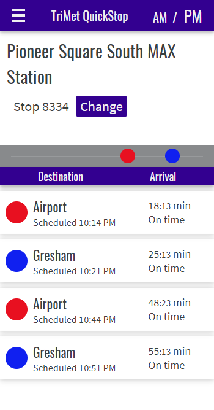

# TriMet QuickStop

### By **Phil Mass**

## Description

_This JavaScript React application shows TriMet commuters the information they want to see in a simple, clean design with minimal clicks. Once they've chosen their regular morning and evening stops, the app shows the arriving MAX trains/buses/streetcars at the relevent stop based on the time of day. If it's before noon, the morning stop is shown. Otherwise, the evening stop is shown._ 

_You can see the deployed version [here](https://philrmass.github.io/trimet-quickstop/)_

_The app also includes a quick stop mode where they can see the arrivals for other stops, outside of their regular commute. It keeps a list of recently searched stops to make this fast. Stops can be looked up by   line name (MAX Orange Line, Bus 70), address (5th and Oak), or proximity to the current location_

_This app follows the progressive web app protocol, which enables the app to be installed and used as a native app on a user's phone_

_The app works without creating an account, so users can test out the functionality. But by registering with with email and password, users can save their stops across devices and also protect against the browser cache being cleared_

_I first had the idea for a simplified no-click TriMet app while attending Epicodus and worked on it as a 4-day [Angular group project](https://github.com/philrmass/trimet-commuter.git) with three other students. I liked the app enough to use it every day, and I'd also fallen in love with React, so I decided to rewite it completely in React, and then pursue all of the other features we never had time to implement. The other member of that group project were [Scott Bergler](https://github.com/skillitzimberg), [Ralph Perdomo](https://github.com/pseudoralph), and [Jared Reando](https://github.com/JaredReando)._



## Setup and Installation

To build the project
* Clone the project from https://github.com/philrmass/trimet-quickstop.git to a local directory
* In a terminal, go into the project directory and install the dependencies with:
```console
npm install
```
* Build the project with:
```console
npm run build 
```
* Build and start up the project on a development server with:
```console
npm start
```
Open up a browser window to the address **localhost:8080** and you should see the app

## Design and Planning

* [Component Tree and Layout](docs/components.md)
* [Design Ideas](docs/design.md)
* [Completed and Remaining Tasks](docs/tasks.md)

## Known Bugs and Missing Features

The app is currently under construction

## Support and Contact Details

If you have any issues or questions, please email me at philrmass@gmail.com

## Technologies

Created in JavasScript using React, Express, CSS Modules, Webpack, Babel, and Eslint

## Legal

Copyright (c) 2019 Phil Mass
